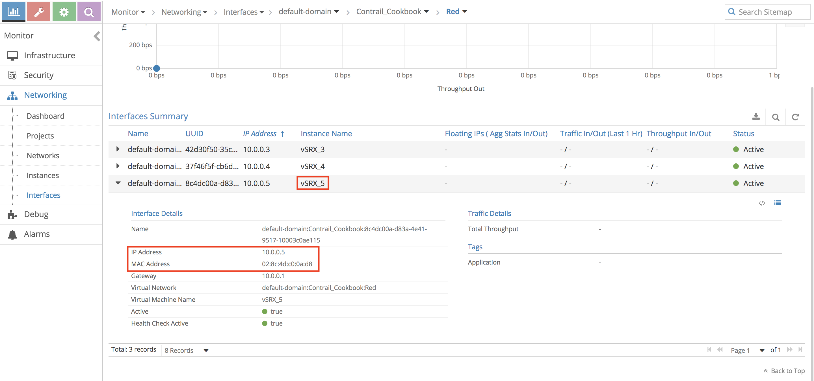
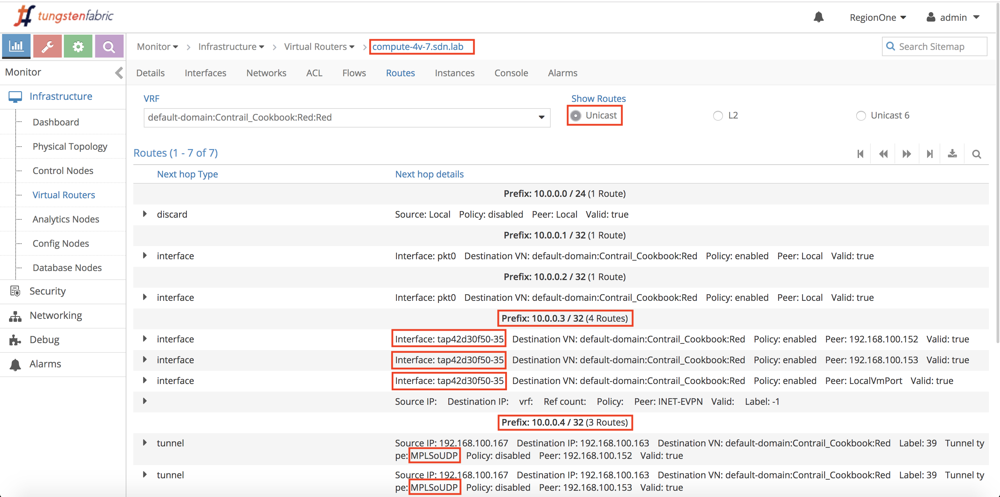
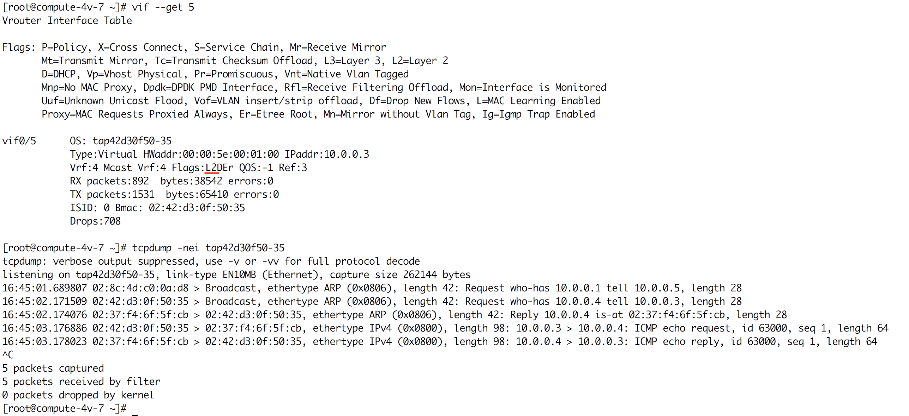
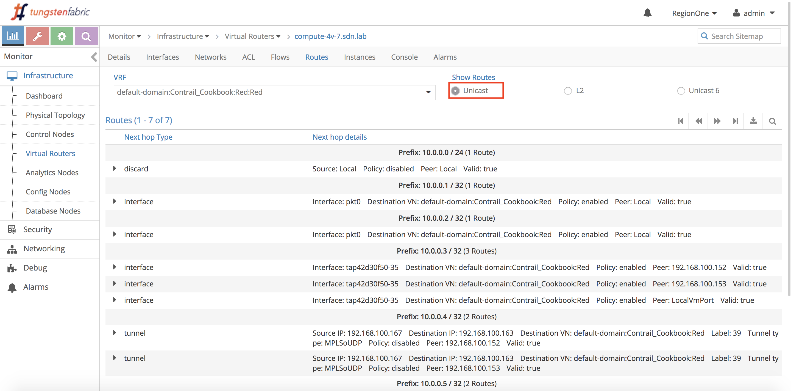

# Virtual Networks

On below screenhoot, we can notice
- Red VN having 3 VMs attached: vSRX_3, vSRX_4 and vSRX_5
- We can understand on which compute the VM runs. Besides, they all run on different computes. 

The following screenshoots show for each VM the associated IP@ and Mac@
- vSRX_3: 10.0.0.3 / 02:42:d3:0f:50:35
- vSRX_4: 10.0.0.4 / 02:35:62:da:f5:b0
- vSRX_4: 10.0.0.5 / 02:03:04:6d:19:c1

## Advanced Options

### Forwarding Mode
Contrail supports 3 forwarding modes: L2 and L3, L2 only and L3 only.

This can be set on a per VN basis, see below.

In next sections, we will focus:
- only on "Red" VN
- from compute-4v-7.sdn.lab that is hosting vSRX-3

Contrail is "Configuration based Learning": configuration for a virtual-machine-interface contains both IP address and MAC address for the interface. For virtual-machines spawned on a compute node, the vrouter will learn IP to MAC address binding from the configuration (Contrail does not perform mac-learning). The MAC binding information is exported in EVPN Routes to the Control Node.

ARP algo is as follow (from VM traffic to vRouter):

    Do Inet route lookup for the IP Destination
    If Route found for the IP Destination
        If Proxy Flag set in the route
            If MAC Stitching information present in the route
                Send ARP Respone with the MAC present in stitching information
            Else // MAC Stitching not found
                If Flood Flag set in the route
                    Flood the ARP packet
                Else // PROXY set, No-Flood, No-MAC Stitching
                    Send ARP response with VRouter MAC address
        Else // Proxy Flag not set
            If Flood flag set in the Route
                Flood the ARP packet
            Else // Proxy Not set, Flood not set
                Drop the packet
    Else // Route not found
        Flood the ARP

Note: ARP processing is greatly further detailed here: https://github.com/Juniper/contrail-controller/wiki/Contrail-VRouter-ARP-Processing 

#### L2 and L3

In this mode IPv4 traffic lookup is done via IP FIB and all non IPv4 traffic is directed to MAC FIB.

This is the default option and should be used unless having a specific requirement.

It is worth mentioning that since we are on compute-4v-7.sdn.lab that is hosting vSRX-3, 10.0.0.3/32 has local tap-interface, while for instance 10.0.0.4/32 has tunneling via MPLSoUDP since being on another compute. Simiraly, 02:42:d3:0f:50:35 has local tap-interface while for instance 02:37:f4:6f:5f:cb has tunneling via MPLSoUDP since being on another compute

Below screenshot shows on compute-4v-7.sdn.lab that vRouter has associated 10.0.0.4 to 02:37:f4:6f:5f:cb. It has "P" in flag to say "proxy".

Below vSRX_3 is pinging vSRX_4. ARP table on vSRX_3 was cleared. We notice that vSRX_3 sends an ARP request for 10.0.0.4 and vRouter will answer the ARQ request thanks to mac@ known above. Besides, on vif interface we can see the flag "L3L2".

#### L2 only

All traffic goes via MAC FIB lookup only.

This option is useful once we have non-IP traffic like legacy protocols in VNF. 

Below we can notice that the IP FIB is empty while the MAC FIB is populated.

In this mode, vRouter will never answer ARP, it will flood ARP. 

Below screenshot shows on compute-4v-7.sdn.lab that vRouter has no IP to Mac@ bindings. 

Below vSRX_3 is pinging vSRX_4. ARP table on vSRX_3 was cleared. We notice that vSRX_3 sends an ARP request for 10.0.0.4 and vRouter broadcast the request. vSRX_4 is answering back accordingly. Besides, on vif interface we can see the flag "L2" and "F" to flood.

#### L3 only

All traffic goes via IP FIB lookup only.

Below we can notice that the IP FIB is populated while the MAC FIB is only having the local MAC@. 

