_This Contrail_Cookbook has been written based on a [Tungsten Fabric](https://tungsten.io/) cluster, from early October trunk build and Openstack Queens._

_screenshots are in PNG format, so a bit heavy and resulting taking some time to load, but best quality_

Table of Contents
=================

   * [Networking](#networking)
      * [Networks (Virtual Networks)](#networks-virtual-networks)
         * [Network Policy(s)](#network-policys)
         * [Host routes](#host-routes)
         * [Advanced Options](#advanced-options)
            * [Forwarding Mode](#forwarding-mode)
               * [L2 and L3](#l2-and-l3)
                  * [Known IP@ and mac@](#known-ip-and-mac)
                  * [Unknown IP@](#unknown-ip)
                  * [Known IP@ but unknown Mac@](#known-ip-but-unknown-mac)
               * [L2 only](#l2-only)
                  * [Unknown IP@](#unknown-ip-1)
                  * [Known IP@ but unknown Mac@](#known-ip-but-unknown-mac-1)
               * [L3 only](#l3-only)
            * [Flood Unknown Unicast](#flood-unknown-unicast)
            * [Reverse Path Forwarding](#reverse-path-forwarding)
            * [Shared](#shared)
            * [IP Fabric Forwarding](#ip-fabric-forwarding)
            * [Allow transit](#allow-transit)
            * [Extend to Physical Router(s)](#extend-to-physical-routers)
            * [PBB EVPN: PBB Encapsulation, PBB ETree, Layer2 Control Word, MAC Learning, Bridge Domains](#pbb-evpn-pbb-encapsulation-pbb-etree-layer2-control-word-mac-learning-bridge-domains)
         * [DNS Server(s)](#dns-servers)
         * [Route Target(s)](#route-targets)
         * [Export Route Target(s) and Import Route Target(s)](#export-route-targets-and-import-route-targets)
         * [Import Policy](#import-policy)
         * [Fat flows](#fat-flows)

# Networking

## Networks (Virtual Networks)

In order to explain the Virtual Networks and all associated knobs, a Red VN with VMs have been created. 

- Red VN having 3 VMs attached: vSRX_3, vSRX_4 and vSRX_5
- We can understand on which compute the VM runs. Besides, they all run on different computes. 

The following screenshoots show for each VM the associated IP@ and Mac@
- vSRX_3: 10.0.0.3 / 02:42:d3:0f:50:35
- vSRX_4: 10.0.0.4 / 02:35:62:da:f5:b0
- vSRX_5: 10.0.0.5 / 02:03:04:6d:19:c1

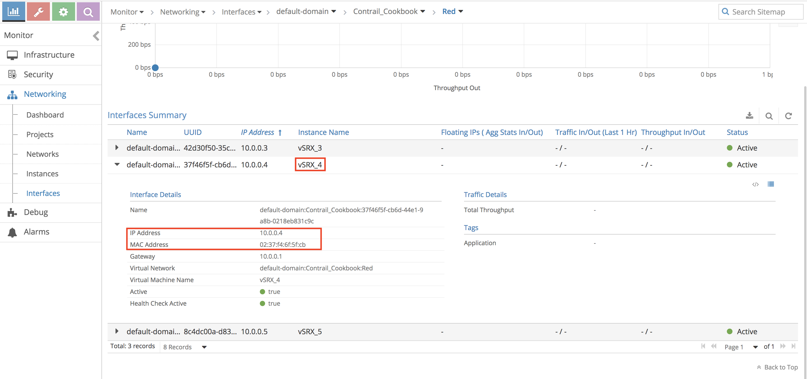

### Network Policy(s)

This option allows to tie a Network Policy to a given VN (a Network Policy must have been defined before). 

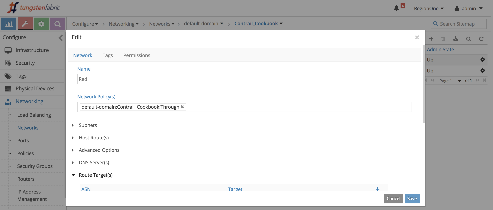

### Subnets

Each VN has a subnet. This subnet could be defined in multiple ways for the Allocation Mode. 

The most common way is "User Defined" as below. It means that the user defines himself the subnet. It is worth mentioning that by default, the GW IP@ will autopupluated by Contrail with x.x.x.1 address or could be manually specified. 

### Host routes

“Host Route” is a way to pass a route to the VM. It is passed via vRouter DHCP offer to the VM, and therefore it is installed into the VM routing table. However, Host routes are not visible into Contrail routing tables. 

Below how to configure it and then result on a Cirros VM.

### Advanced Options

#### Forwarding Mode
Contrail supports 3 forwarding modes: L2 and L3, L2 only and L3 only. Note that default option means L2 and L3.

This can be set on a per VN basis, see below.

In next sections, we will focus:
- only on "Red" VN
- from compute-4v-7.sdn.lab that is hosting vSRX-3

Contrail is "Configuration based Learning": configuration for a virtual-machine-interface contains both IP address and MAC address for the interface. For virtual-machines spawned on a compute node, the vrouter will learn IP to MAC address binding from the configuration (Contrail does not perform mac-learning). The MAC binding information is exported in EVPN Routes to the Control Node.

VRouter behavior on receiving an ARP Request (from VM to vRouter):

    Do Inet route lookup for the IP Destination
    If Route found for the IP Destination
        If Proxy Flag set in the route
            If MAC Stitching information present in the route
                Send ARP Respone with the MAC present in stitching information
            Else // MAC Stitching not found
                If Flood Flag set in the route
                    Flood the ARP packet
                Else // PROXY set, No-Flood, No-MAC Stitching
                    Send ARP response with VRouter MAC address
        Else // Proxy Flag not set
            If Flood flag set in the Route
                Flood the ARP packet
            Else // Proxy Not set, Flood not set
                Drop the packet
    Else // Route not found
        Flood the ARP

_Note: ARP processing is greatly further detailed here: https://github.com/Juniper/contrail-controller/wiki/Contrail-VRouter-ARP-Processing_ 

##### L2 and L3

In this mode IPv4 traffic lookup is done via IP FIB and all non IPv4 traffic is directed to MAC FIB.

This is the default option and should be used unless having a specific requirement.

In below, it is worth mentioning that since we are on compute-4v-7.sdn.lab that is hosting vSRX-3, 10.0.0.3/32 has local tap-interface, while for instance 10.0.0.4/32 has tunneling via MPLSoUDP since being on another compute. Simiraly, 02:42:d3:0f:50:35 has local tap-interface while for instance 02:37:f4:6f:5f:cb has tunneling via MPLSoUDP since being on another compute

###### Known IP@ and mac@

Below screenshot shows on compute-4v-7.sdn.lab that vRouter has associated 10.0.0.4 to 02:37:f4:6f:5f:cb. It has "P" in flag to say "Proxy ARP".

Below vSRX_3 pings vSRX_4 (ARP table on vSRX_3 was cleared). We notice that vSRX_3 sends an ARP request for 10.0.0.4 and **vRouter** will answer the ARP request thanks to mac@ known above. Besides, on vif interface we can see the flag "L3L2".

###### Unknown IP@

_This is a corner case and most of the time the result of bad VNF implementation._ 

Here we have unconfigured DHCP on vSRX_5 and manually set IP@ 10.0.0.12/32. So as explained before, because Contrail knows the IP@ and Mac@ bindings via OpenStack, this IP@ will be unknown.

Below the mac@ of IP@ 10.0.0.12/32 is resolved, but ICMP packets are dropped since unknown IP@.

A workaround to make it work is to define the new IP@ via AAP on the vSRX_5 port.

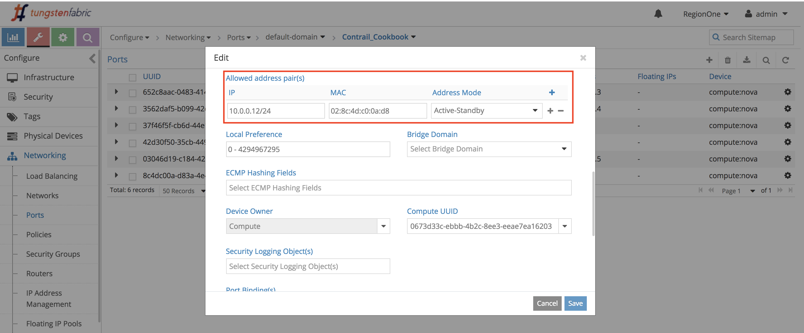

_L2-only allows this scenario without extra AAP and this is shown later._ 

###### Known IP@ but unknown Mac@

_This is a corner case and most of the time the result of bad VNF implementation._ 

Here we have manually set on vSRX_5 a new mac@ 02:8c:4d:c0:00:01 but keep initial IP@ 10.0.0.5. So as explained before, because Contrail knows the IP@ and Mac@ bindings via OpenStack, this Mac@ will be unknown.

Below we see resolution of mac@ for 10.0.0.5, but since vRouter act as proxy, it answers back with mac@ known by vRouter but it is wrong. vSRX_3 sends ping to a wrong mac@. L2-only allows this scenario and this is shown later.

A workaround to make it work is to define the new mac@ via AAP on the vSRX_5 port.

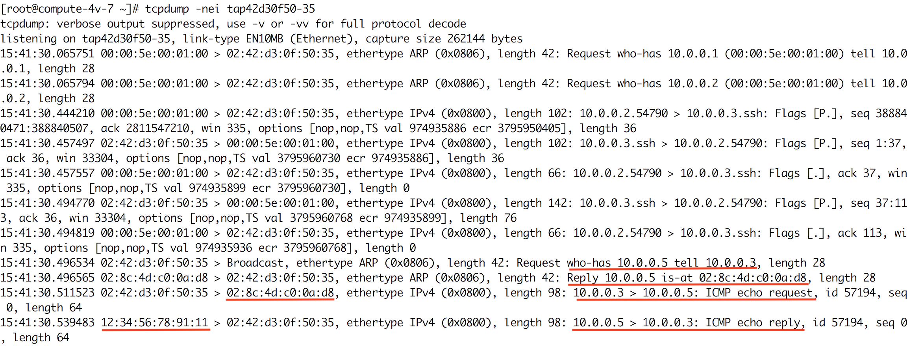

_L2-only allows this scenario without extra AAP and this is shown later._ 

##### L2 only

All traffic goes via MAC FIB lookup only.

_Note: This option is useful once we have non-IP traffic like legacy protocols in VNF (PXEboot, DHCP request to another VM, etc.)._ 

Below we can notice that the IP FIB is empty while the MAC FIB is populated.

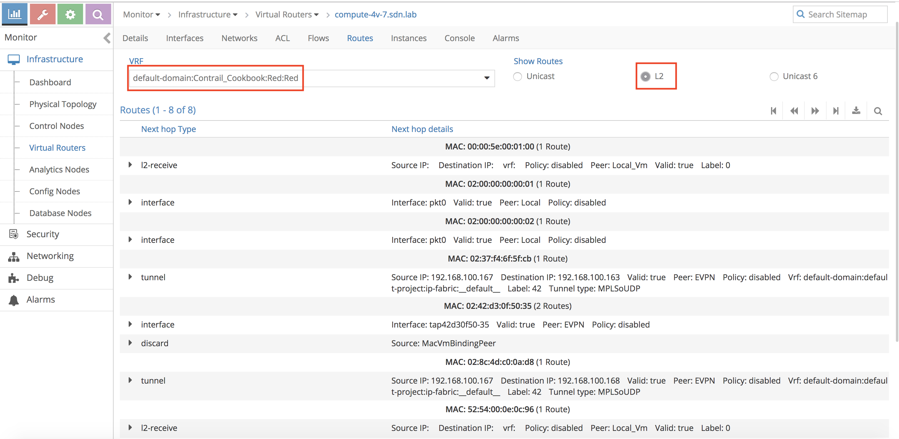

In this mode, vRouter will never answer ARP, it will flood ARP. 

Below screenshot shows on compute-4v-7.sdn.lab that vRouter has no IP to Mac@ bindings. 

Below vSRX_3 pings vSRX_4. ARP table on vSRX_3 was cleared. We notice that vSRX_3 sends an ARP request for 10.0.0.4 and vRouter broadcast the request. vSRX_4 is answering back accordingly. Besides, on vif interface we can see the flag "L2".

###### Unknown IP@

_This is a corner case and most of the time the result of bad VNF implementation._ 

Here we have unconfigured DHCP on vSRX_5 and manually set IP@ 10.0.0.12/32. So as explained before, because Contrail knows the IP@ and Mac@ bindings via OpenStack, this IP@ will be unknown.

Below the mac@ of IP@ 10.0.0.12/32 is resolved and ICMP packets are going through. 

###### Known IP@ but unknown Mac@

_This is a corner case and most of the time the result of bad VNF implementation._ 

Here we have manually set on vSRX_5 a new mac@ 02:8c:4d:c0:00:01 but keep initial IP@ 10.0.0.5. So as explained before, because Contrail knows the IP@ and Mac@ bindings via OpenStack, this Mac@ will be unknown.

Below we see resolution of mac@ for 10.0.0.5 with 02:8c:4d:c0:00:01. However only ICMP echo goes through. vRouter is dropping packet since seeing an unknown mac@.

In order to make it work, need to add in the VN the knob "Flood Unknown Unicast".

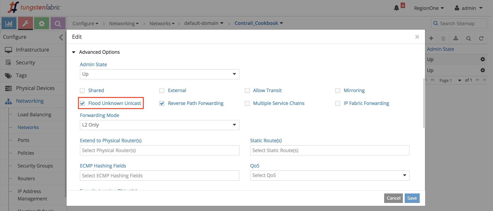

##### L3 only

All traffic goes via IP FIB lookup only.

Below we can notice that the IP FIB is populated while the MAC FIB is only having the local MAC@. 

#### Flood Unknown Unicast

In Contrail, all mac@ are known from OpenStack and advertised via EVPN. There is no mac-learning. Therefore, by default Contrail  will drop unknown mac@. This knob allows in corner case situation to allow it, see example [here](https://github.com/NicoJNPR/Contrail_Cookbook/blob/master/docs/index.md#known-ip-but-unknown-mac-1)  

#### Reverse Path Forwarding

By default, Contrail has "Reverse Path Forwarding" knob enables in the VN. It means that vRouter checks that the source has a valid IP@ in FIB. Note that it only works for inter-subnet IP@, not intra-subnet IP@.

To demonstrate the feature, let's configure for instance a loopback 11.0.0.9/32 on vSRX_3. From vSRX_3 do ssh to vSRX_4 from this new loopback. 

Below, Reverse Path Forwarding is enabled on VN red, it shows that the compute hosting vSRX_4 is not having any ssh trace. The reason is that compute hosting vSRX_3 is dropping the packet since RPF is on. 

Below, Reverse Path Forwarding is now disabled on VN red, it shows that the compute hosting vSRX_4 is now having ssh trace, so it works.  

#### Shared

A VN is defined for a project. It means that another project will not see this VN. 
However, sometimes it is desired that a VN is seen by all other projects (i.e. an Internet VN shared for all projects).

Below, we have a new project "Other_tenant", and we can notice there is no VN. 

Below, after we enable shared on Red VN in Contrail_Cookbook project, we can notice the Red VN is now visible in "Other_tenant" project.

#### IP Fabric Forwarding

This feature enables to connect a VN directly to the underlay (aka Fabric). It will leak the VN routes to the underlay routing instance. This is to allievate the need of an SDN GW, but at the cost of loosing the overlay benefits and with native MPLS integration with the backbone. 

Below shows the "Fabric" underlay routing instances. We can notice prefix with 192.x.x.x but none with 10.x.x.x that we use in Red VN.

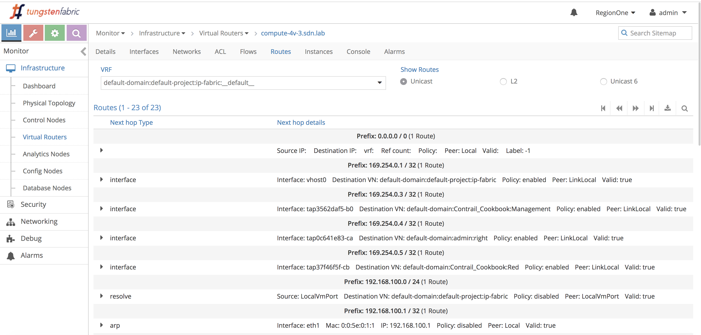

Below shows how to enable "IP Fabric Forwarding".

Below shows that now Red VN routes are also present in the "Fabric" underlay routing instance.

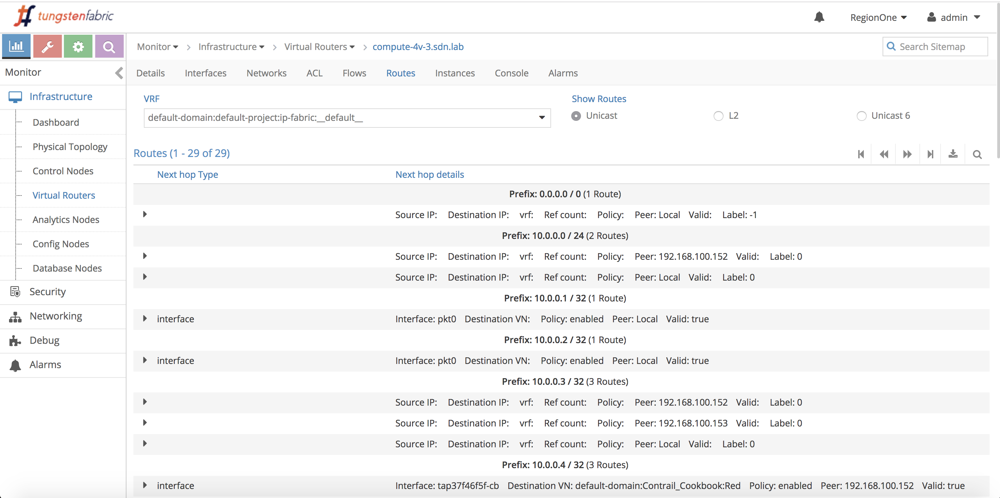
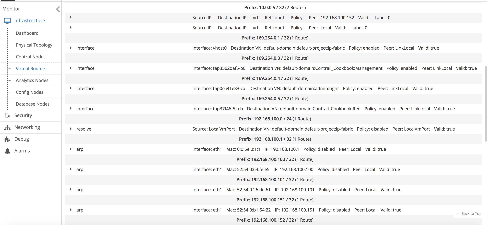

Also, the Red VN now has a default route to underlay.

Finally, in order to make it work, we need to create a policy to allow traffic from Red VN to Fabric and apply it to Red VN network. 

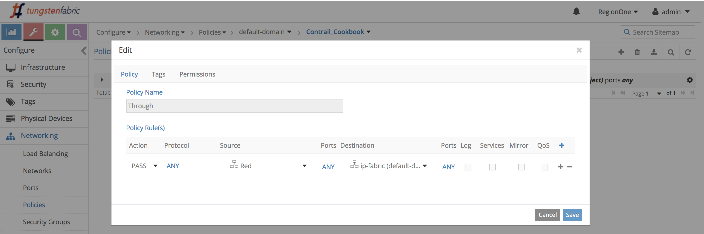

Below shows a ping from vSRX_4 having 10.0.0.4 to an underlay device having 192.168.100.151. It is eth1 interface, so egressing straight to the underlay (there is no ICMP reply because no routes in underlay to 10.0.0.4)

#### Allow transit

Allow transit enables to readvertise service-chain routes from a VN to another service-chain. Note that a VN cannot be connected directly to a transit VN.

The use case is VNLeft----SI1----VNmiddle-----SI2-----VNRight. This assumes being familiar with Contrail service-chaining (ST, SI, ploicy, etc.). 

So routes from VNRight will by default be readvertised to VNmiddle as per service-chaining. However, they won't be readvertised to VNleft, see below.

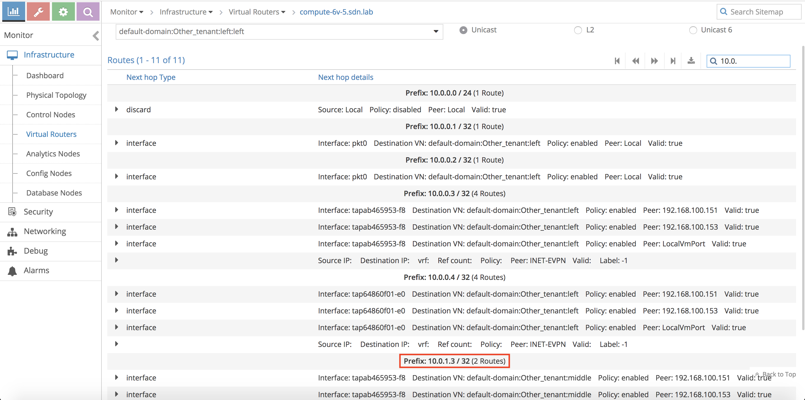

However, if we enable "allow transit" on VNmiddle, VNRight routes in VNmiddle will be readvertised to VNLeft (and vice-versa from Left to Right). 

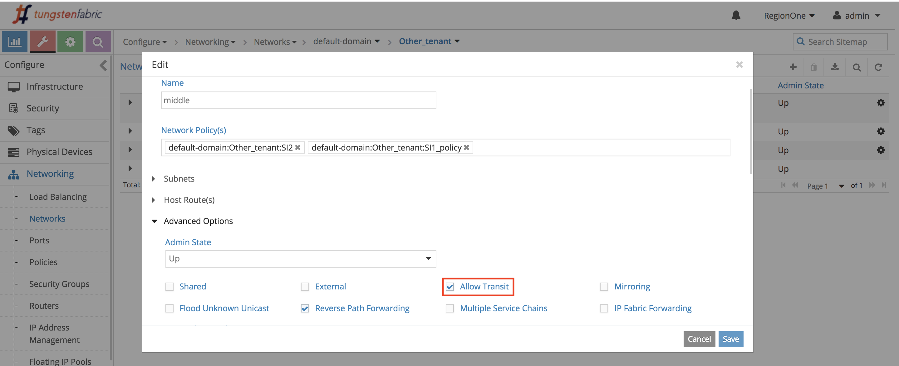

#### Extend to Physical Router(s)

It is relevant only if Device-Manager is used. In such a case, it enables to automatically push necessary information to extend the VN to the MX SDN GW.

#### PBB EVPN: PBB Encapsulation, PBB ETree, Layer2 Control Word, MAC Learning, Bridge Domains

For a very particular scenario, PBB EVPN has been developed on Contrail. 

Specification is [here](https://github.com/Juniper/contrail-specs/blob/master/pbb_evpn.md).

Below the UI knobs related to PBB EVPN (not explained).

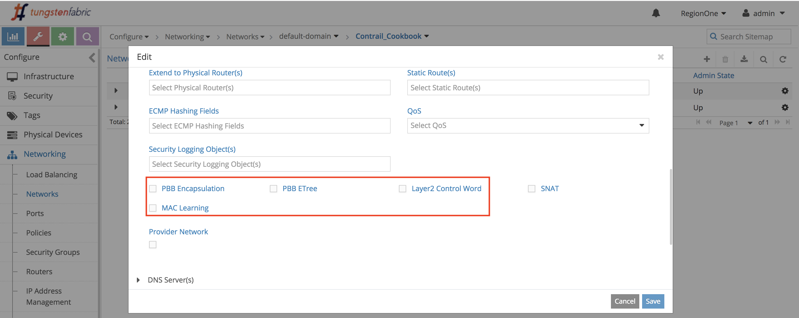 

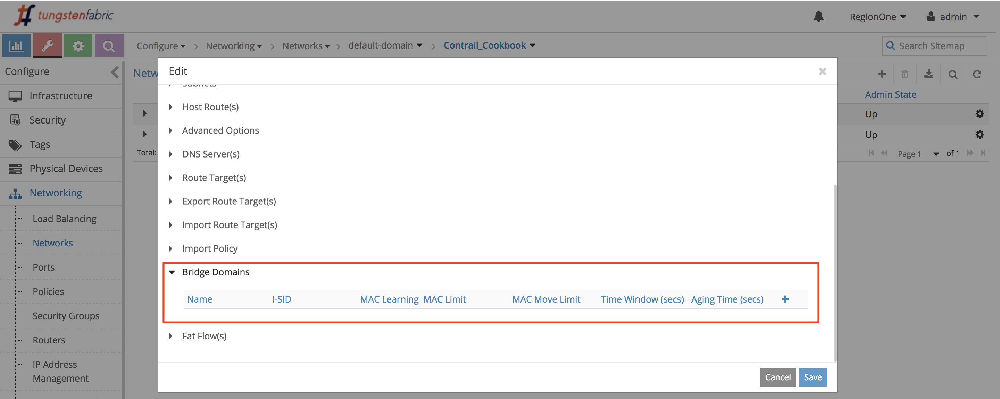 

### DNS Server(s)

This option allows to pass DNS IP@ to the VMs via DHCP for a given VN. 

Below we are setting for Red VN 8.8.8.8 as DNS IP@. Then we connect on a Cirros image to show that it is applied.

 

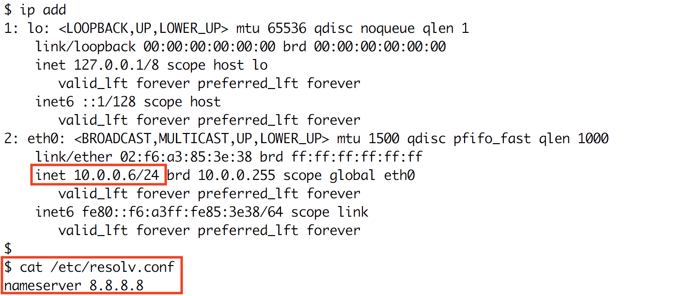 

### Route Target(s)

This option allows to specify a specific RT for a VN. Note that Contrail automatically set a RT for a VN. 

Below it shows Red VN with its RT auto set by Contrail. 

 

Below it shows how to add a specific RT (in addition to the Contrail auto-generated one) and the result.

 

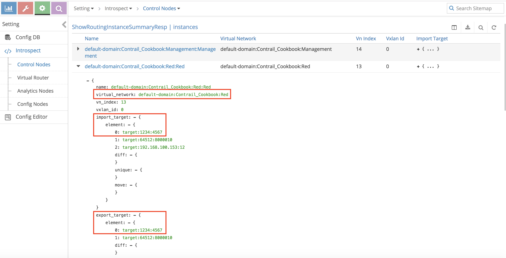 

We can also look a given route in Red VN to notice the RT (only export)

 

### Export Route Target(s) and Import Route Target(s)

Unlikeprevious feature that easily make symmetric RT and which is a common use case, we can have asymmetric RTs for a VN.

Below it shows how to add a asymmetric RT (in addition to the Contrail auto-generated one) and the result.

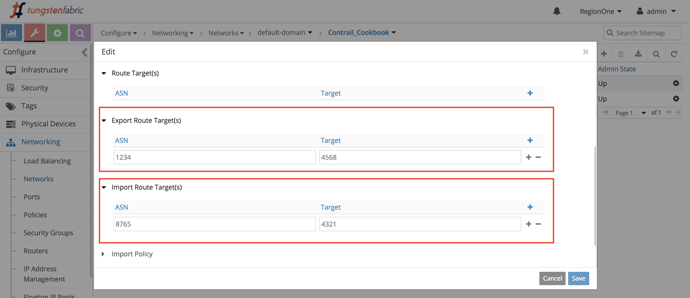 

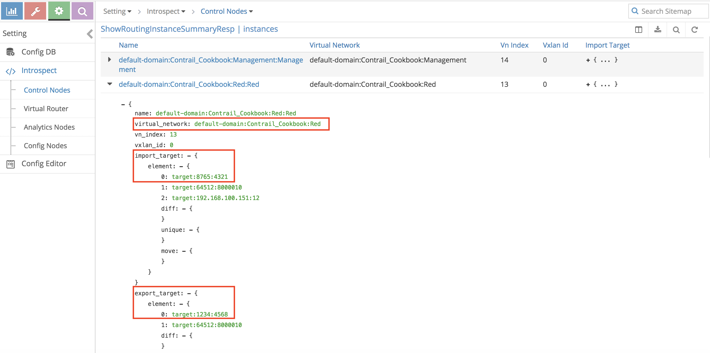 

### Import Policy

An import policy allows to refer to a routing policy. Basically, it enables to manipulate routes into the VN (add/remove community, LP, MED, reject, etc.). If the VN is extended to an SDN GW, it will inherit the manipulation (meaning an LP set on a route in a VN, it will get this particular LP into the VRF of the SDN GW).  

_Routing Policy are further described in relevant section._ 

### Fat flows

TBC

