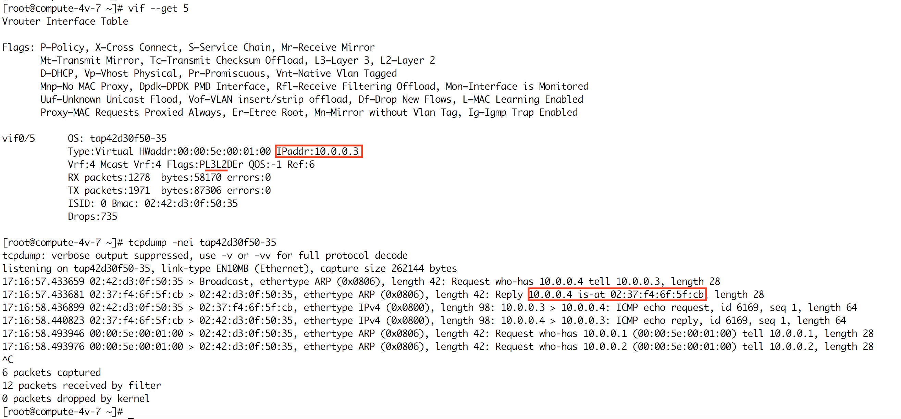

# Virtual Networks

On below screenhoot, we can notice
- Red VN having 3 VMs attached: vSRX_3, vSRX_4 and vSRX_5
- We can understand on which compute the VM runs. Besides, they all run on different computes. 

The following screenshoots show for each VM the associated IP@ and Mac@
- vSRX_3: 10.0.0.3 / 02:42:d3:0f:50:35
- vSRX_4: 10.0.0.4 / 02:35:62:da:f5:b0
- vSRX_4: 10.0.0.5 / 02:03:04:6d:19:c1

## Advanced Options

### Forwarding Mode
Contrail supports 3 forwarding modes: L2 and L3, L2 only and L3 only.

In next sections, we will focus:
- only on "Red" VN
- from compute-4v-7.sdn.lab that is hosting vSRX-3

#### L2 and L3

In this mode IPv4 traffic lookup is done via IP FIB and all non IPv4 traffic is directed to MAC FIB.

This is the default option and should be used unless having a specific requirement.

It is worth mentioning that since we are on compute-4v-7.sdn.lab that is hosting vSRX-3, 10.0.0.3/32 has local tap-interface, while for instance 10.0.0.4/32 has tunneling via MPLSoUDP since being on another compute. Simiraly, 02:42:d3:0f:50:35 has local tap-interface while for instance 02:37:f4:6f:5f:cb has tunneling via MPLSoUDP since being on another compute

In this mode, vRouter will act as proxy-ARP. He will answer with its own MAC@

Below vSRX_3 is pinging vSRX_4. ARP table on vSRX_3 was cleared. We notice that vSRX_3 sends an ARP request for 10.0.0.4. vRouter is answering back accordingly. Besides, on vif interface we can see the flag "L3L2".

#### L2 only

All traffic goes via MAC FIB lookup only.

This option is useful once we have non-IP traffic like legacy protocols in VNF. 

Below we can notice that the IP FIB is empty while the MAC FIB is populated.

This 

In this mode, vRouter will NOT answer ARP. 

Below vSRX_3 is pinging vSRX_4. ARP table on vSRX_3 was cleared. We notice that vSRX_3 sends an ARP request for 10.0.0.4. vSRX_4 is answering back accordingly. Besides, on vif interface we can see the flag "L2".

#### L3 only

All traffic goes via IP FIB lookup only.

Below we can notice that the IP FIB is populated while the MAC FIB is only having the local MAC@. 

